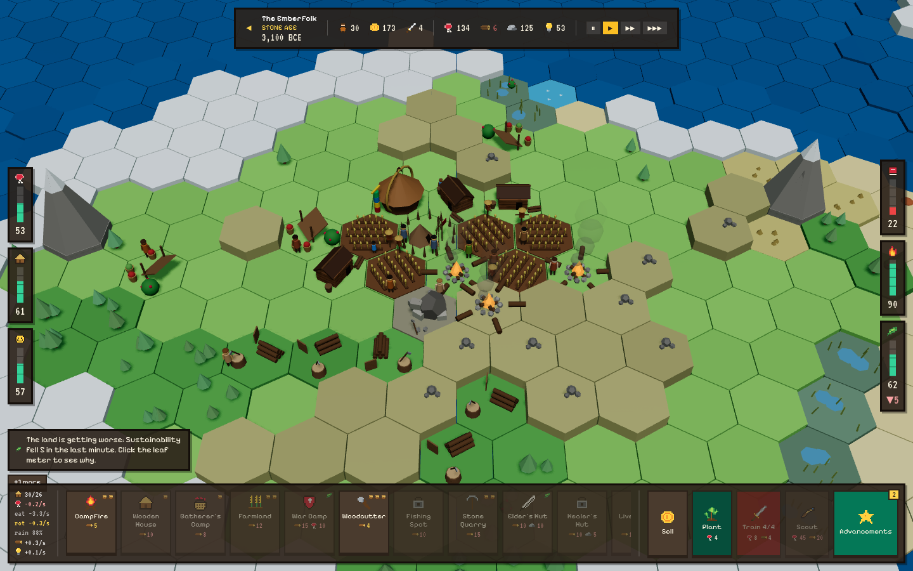
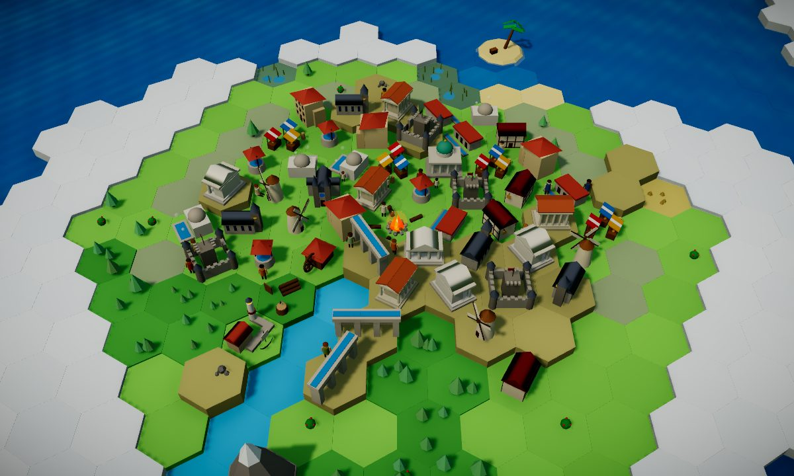
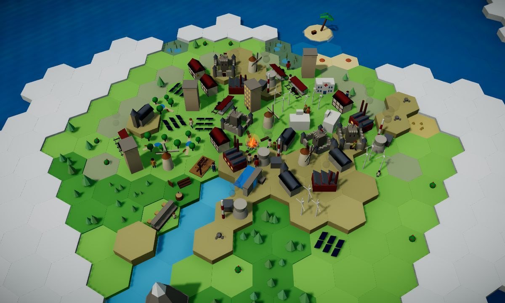
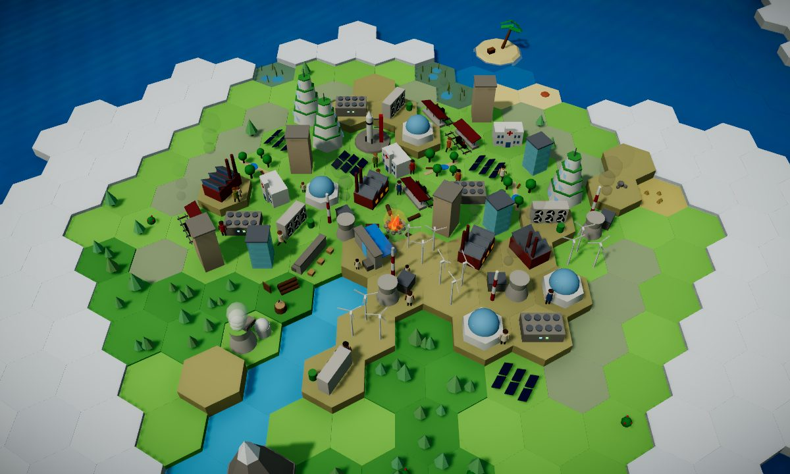

# 🔥 Emberline

**Grow a civilization from the Stone Age to space, without wrecking the land it lives on.**

Emberline is a real-time hex-island city builder where every home, farm and power plant brings a benefit *and* a cost. Built for the **SHISTECH Hacktrack** hackathon (UN Sustainable Development Goals theme) around **SDG 11: Sustainable Cities and Communities**.

### ▶ [Play it now](https://dabababoi.github.io/emberline-game-actual/)

No install. Runs in the browser on a laptop or a phone.



| Medieval | Industrial | Future |
| --- | --- | --- |
|  |  |  |

> **Judges:** full documentation, mapped to each judging criterion, is in [`docs/`](docs/README.md): [game design](docs/design.md) · [architecture](docs/architecture.md) · [process and testing](docs/process.md) · [finals presentation plan](docs/presentation.md).
>
> **Still to add:** gameplay GIF (`assets/gameplay.gif`) and demo video link.

---

## The idea

Most city builders reward you for building as much as you can. Emberline asks the question SDG 11 asks: **can a settlement grow without wrecking the place it lives in?**

Every building shows what you get and what the land pays, right where you place it:

| You build | You get | The land pays |
| --- | --- | --- |
| Woodcutter | Wood for fires and building | Fells nearby trees; with none left, no wood |
| Campfire | Warmth for 10 people | Burns wood, adds smoke, risks wildfire, sparks can burn a house next door |
| Gatherer's Camp | Wild food | Each extra camp adds only a quarter of the food; past two, animals are hunted faster than they breed |
| Wooden House | Room for 6 people | More mouths, more fires needed, flammable |
| Farmland | Lots of steady food | Clears forest for good, and fewer trees means less rain for every field |
| Stone Quarry | Stone for better buildings | Cuts the hill into a pit; dust cuts nearby harvests |
| Livestock Pen | Food, and clothes so you need fewer fires | Grazing wears down the grass |
| Bronze Smithy | +20% food and wood | Burns charcoal constantly, heavy smoke |
| Irrigation Canal | Neighbouring farms grow 50% more | Soil slowly turns salty |

Slower, kinder options exist too: **selective logging** instead of clear-cutting, **replanting** saplings or a Forester's Lodge, **clothes** instead of fires, and **Granaries** instead of letting food rot.

**Sustainability** is how much forest is still standing around the village (minus smoke, quarries, fields and more). Click the leaf meter to see exactly what is pulling it down. Let it stay low too long and the land wears out: forests stop regrowing and harvests shrink.

## How the game teaches

- **See the cost before you build.** Trade-off cards on every placement, warnings like "dust would cut the food of 2 buildings nearby", and a Sustainability breakdown with a trend arrow.
- **A tutorial that talks to you.** Elder Ama walks you through your first fire, woodcutter, house, camp, scouts, warrior and farm, with a pointing hand and exactly the supplies each step needs.
- **Advancements are earned by doing.** Keep a fire burning before Storytelling, hunt before Herding, lose food to rot before Pottery.
- **Lessons tied to real targets.** When something happens (forest shrinks, rains fail, food rots, sickness spreads), Elder Ama explains why and links it to a UN target.
- **Real-world event cards.** Dilemmas like a sacred grove, overhunting, or a rich but flood-prone riverbank.
- **An honest debrief.** Each era ends with achievements next to their cost (forest lost, lives lost). The best ending needs **Sustainability ≥ 60**, and a starving village never gets one.

### SDG mapping

| Goal | In the game |
| --- | --- |
| **11 · Sustainable Cities & Communities** | Shelter, crowding, water and sanitation, planned growth, pollution |
| 13 · Climate Action | Smoke and coal raise carbon; the last era is about bringing it back down |
| 15 · Life on Land | Forest, wildlife, rainfall, soil health and replanting |
| 7 · Affordable & Clean Energy | Campfires to coal to wind, sun and fusion; clean power wins the last era |

## Features

- **Six eras, 57 buildings, 109 advancements**: Stone, Ancient, Classical, Medieval, Industrial, Future
- **Six meters**: Food, Shelter, Happiness, Literacy, Energy, Sustainability
- **Living map**: people walk to work, sit by fires, fall sick and hunt; paths wear into the ground; hunters only hunt when food is needed
- **Era set pieces**: Roman legion, the great drought, the plague, the climate crisis and the launch into space
- **Raids**: fight, hide, or pay them off; arm warriors and build Watch Towers
- **Trade** with passing traders, caravans and neighbouring kingdoms
- **Pick people up** and drop them on buildings, cold fires, or the sea (risky)
- **Online multiplayer** for up to 4 players: race for Chief XP or play co-op, with gifts, raids and chat. Bots keep pace with players.
- **Two main ways to play**, side by side: **From the Stone Age** (the full journey), or **Build to Last**, starting in 1850 with a smoky town. Clear the air, switch to clean power, and house 120 people with the forest standing. Click a problem to see how to solve it.
- **Six ways to lose**, each with a countdown: famine, unrest, land collapse, conquest, plague, being left behind
- **First time mode**: slower clock, calm Stone Age, no raids or disasters
- **Autosave**, cloud saves by code, leaderboard, feedback form and in-game **How to play** guide

## Controls

| Action | Laptop | Phone |
| --- | --- | --- |
| Move camera | Drag | One-finger drag |
| Zoom / rotate | Scroll / right-drag | Pinch / two-finger drag |
| Build | Pick a building, click a tile | Tap to preview, tap again to build |
| Building info | Click the building | Tap the building |
| Cancel | `Esc`, right-click or **Cancel** | **Cancel** |
| Why is Sustainability low? | Click the leaf meter | Tap the leaf meter |
| Speed | Pause / 1× / 2× / 4× in top bar | Same |

## What went wrong and how we adapted

- **Wrong game first.** We built a turn-based meters-and-buttons sim, then rebuilt it as a real-time hex-island builder.
- **Multiplayer cut, then returned.** GitHub Pages had no server, so we dropped it. Supabase later brought back cloud saves, the leaderboard and rooms (every player runs the game locally; only scores, gifts and raids go through the database).
- **Emojis looked cheap.** Replaced with hand-drawn 12×12 pixel sprites.
- **Villagers walked through mountains.** They now follow terrain height and steer around obstacles.
- **Unrealistic pollution.** Woodcutters used to make smog. Smoke now comes only from fires, and Sustainability is based on forest actually standing.
- **Balance swung both ways.** Too easy, then overwhelming. We slowed the clock and let pressure build with tribe size.
- **Players survived without learning.** So the trade-off moved in front of every decision, with sustainable alternatives, lessons and event cards.
- **Tutorial rough edges.** Skippable, slow, and robotic. Added a click-blocking pointing hand, supplies per step, and rewrote Ama's lines as a conversation.
- **Choices with no downside.** Camps were spammable and quarry costs ignored. Extra camps now add little and hurt wildlife; quarry dust cuts nearby harvests.
- **Knowledge pacing.** Players hit the Ancient era in five minutes, then we overcorrected. A bot that plays by the real rules helped us tune it to about 20 minutes.
- **Eras looked identical.** Added dyed clothes, worn paths, warmer light and bronze trim.
- **Many small bugs.** Stale saves, loss shown as "best ending", look-alike digits, skipped countdown seconds, overlapping panels, off-screen tutorial pointers. Fixed as players found them.

## How we built this

We built Emberline with an AI coding assistant (**Claude Code**). Most code was written by the assistant following our direction, and we want to be upfront about that.

**The team** decided what the game is (Stone Age start, a cost on every building, the eras, the ways to lose, the look; all written in [`AGENTS.md`](AGENTS.md)), playtested it repeatedly with friends, turned feedback into changes, and reviewed and merged every pull request.

**The assistant** wrote and tested the code (including the balance bot), took screenshots, and drafted docs and slides for us to review.

**Who did what:** _[fill in before submitting]_

## Tech stack

Next.js 16 (static export) · React 19 · TypeScript · Tailwind CSS · React Three Fiber / Three.js · GitHub Pages · Supabase (cloud saves, leaderboard, feedback; only the public publishable key is in the code)

## Project structure

```
src/
  game/                 Pure game logic, no React
    types.ts            State and data shapes
    content.ts          Eras, buildings, advancements, events, lessons, tutorial
    engine.ts           Reducer, ticks, meters, raids, the legion, saving
    disease.ts          Outbreaks, spread, recovery
    map.ts, hex.ts      Hex maths and island generator
    noise.ts            Seeded random and noise
    sprites.ts          Pixel icons
    updates.ts          "What's new" list
  components/civ/
    game-screen.tsx     Title screen to game, HUD layout
    game-provider.tsx   State, tick loop, autosave
    guide.ts            Tutorial hand
    title-screen.tsx    Name, culture, difficulty
    hud/                Top bar, meters, advancements, lessons, debrief
    world/              3D: terrain, buildings, people, battles, smoke
  lib/online.ts         Supabase: saves, leaderboard, feedback
  app/play/page.tsx     The game
public/                 Project page (plain HTML/CSS/JS), fonts, screenshots
scripts/export-site.mjs Builds project-page icons and update list from game code
```

## Running it locally

```bash
git clone https://github.com/DaBabaBOI/emberline-game-actual.git
cd emberline-game-actual
npm install
npm run dev        # http://localhost:3000, then open /play
```

Needs [Node.js](https://nodejs.org/) 22 (see `.nvmrc`). Downloaded the ZIP? Same steps. Double-clicking a file won't work; the game must be served.

| Script | Does |
| --- | --- |
| `npm run dev` | Dev server with hot reload |
| `npm run build` | Static build into `out/` |
| `npm run site` | Rebuild project-page icons and update list |
| `npm run lint` | ESLint |
| `npm run typecheck` | TypeScript check |
| `npm run format` | Prettier |

Every push to `main` deploys to GitHub Pages.

**Dev mode:** open [`/play/?dev`](https://dabababoi.github.io/emberline-game-actual/play/?dev) to start in any era with plenty of resources and a panel to trigger wildfires, raids, the legion, outbreaks, any event or lesson, "Goals on", finish the era, starve, collapse and more.

## Contributing

- Read [`AGENTS.md`](AGENTS.md) first (humans and AI assistants alike). It holds the design decisions the game must stay true to.
- Game rules live in `src/game/`; the engine stays reducer-based and immutable; UI and 3D stay separate from logic; prefer data-driven content.
- Never commit to `main`. Branch as `feat/<name>-<thing>` (or `fix/`, `chore/`, `docs/`), open a PR, get a review. Commit messages are imperative ("add farmland").
- Every player-visible change gets a line in `src/game/updates.ts`.

See [CONTRIBUTING.md](CONTRIBUTING.md) and [SECURITY.md](SECURITY.md).

## Roadmap

The six-era campaign is complete. Next: **shared-map multiplayer** (one player's smoke and clear-cutting reaches neighbours), **classroom mode** (teacher picks era and crises, sees how each group chose) and **more languages**.

## License

Public domain under the [Unlicense](LICENSE).

## Team

Prithu Sharma · Aarav Kumar · Vagisha Sinha · Aaradhya Verma