# Emberline: project documentation

**Emberline** is a browser game about sustainability trade-offs. Players guide
a civilization through scenarios set across six eras; some begin at the first
campfire, while others start later with their own challenges. Every building
helps the people now and costs the land later. Up to four people can play
together online. It was made by Prithu Sharma, Aarav Kumar,
Vagisha Sinha and Aaradhya Verma for the SHISTECH Hacktrack hackathon (theme:
the UN Sustainable Development Goals, with SDG 11 as our focus).

- **Play:** https://dabababoi.github.io/emberline-game-actual/ (no install, laptop or phone)
- **Dev mode, for testing any feature quickly:** https://dabababoi.github.io/emberline-game-actual/play/?dev
- **Code:** this repository. The rules are in `src/game/`; the screen and 3D world are in `src/components/civ/`.

## What we submit (checklist)

| Item | Where it is | Status |
| --- | --- | --- |
| Working project | The live link above; code in this repository | Done |
| **Project schematic** | (the team is making it) | **Team** |
| Code, documented and organized | `src/game/` (rules), `src/components/civ/` (screen and 3D), comments in the code, [`AGENTS.md`](../AGENTS.md) (every design rule) | Done |
| Design evidence | [`design.md`](design.md), the [screenshots](#screenshots), the [process and testing log](process.md) | Done |
| Presentation deck (5–10 min) | (the team is making it) | **Team** |
| Video of the game being played | (the team is making it; link it here and in the main README) | **Team** |
| Photos of the team working | `docs/images/` | **Team: add 2–3** |

## Where to find what (by judging criterion)

| Criterion | Where to look |
| --- | --- |
| **1. Innovation & Impact** (creativity, relevance) | [Game design: the idea and why it matters](design.md#1-the-idea) and [SDG links](design.md#5-links-to-the-sdgs) |
| **2. Technical Execution** (runs smoothly, complexity) | [Architecture](architecture.md) and [testing](process.md#3-how-we-test) |
| **3. Design & Presentation** (clarity, looks, usability) | [Look and usability](design.md#6-look-and-usability), the [screenshots](#screenshots) and the [presentation plan](presentation.md) |
| **4. Problem-Solving & Thinking** (logic, adaptability) | [Process: problems we hit and how we adapted](process.md) |
| **5. Implementation of the chosen feature** (clean, cohesive) | [The trade-off system: how it is built and how it fits](design.md#3-the-chosen-feature-trade-offs-you-can-see) |
| **6. Documentation & Completeness** (code & schematics; supporting materials) | This folder, the project schematic, the [main README](../README.md), [`AGENTS.md`](../AGENTS.md) (every design rule), in-code comments, screenshots, and the gameplay video |

## The documents

1. [`design.md`](design.md): the idea, the core loop, the trade-off system, how
   the systems connect, SDG links, look and usability.
2. [`architecture.md`](architecture.md): diagrams of the code, the game loop, the
   data flow and the folder layout, plus the rules the code follows.
3. [`process.md`](process.md): how we worked, what went wrong, how we fixed
   it, and how we test (including the balance bot and its latest results).
4. [`presentation.md`](presentation.md): the plan for the 5–10 minute finals
   talk and live demo, with likely questions.

## Screenshots

Every picture below is a real capture of the current build. None are mock-ups.
The village pictures come from a game played by our test bot (see
[process.md](process.md#3-how-we-test)), loaded into the browser.

| | |
| --- | --- |
| 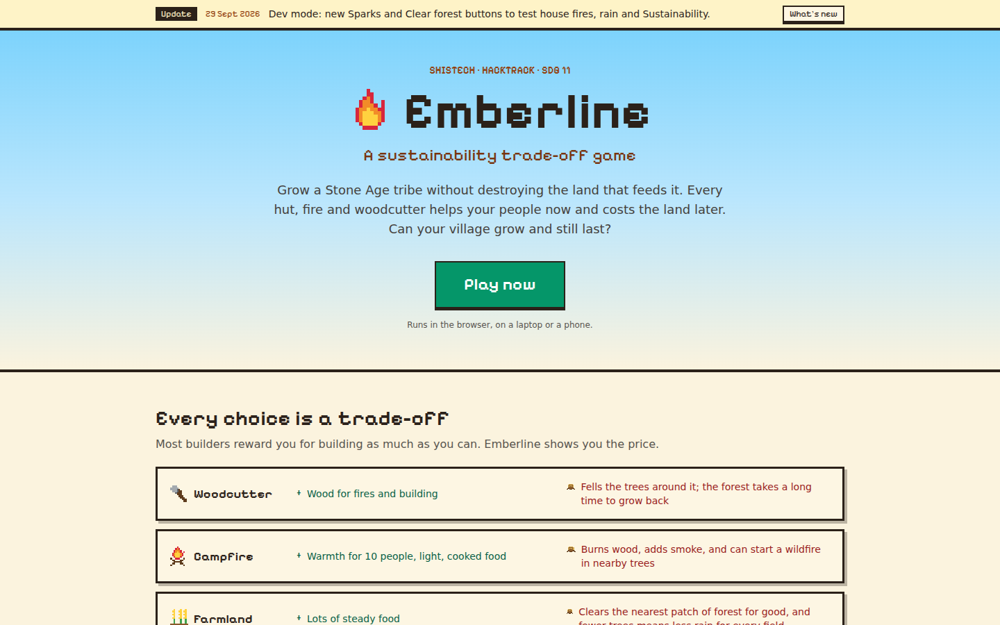 **Landing page.** The pitch, and the trade-offs up front. | 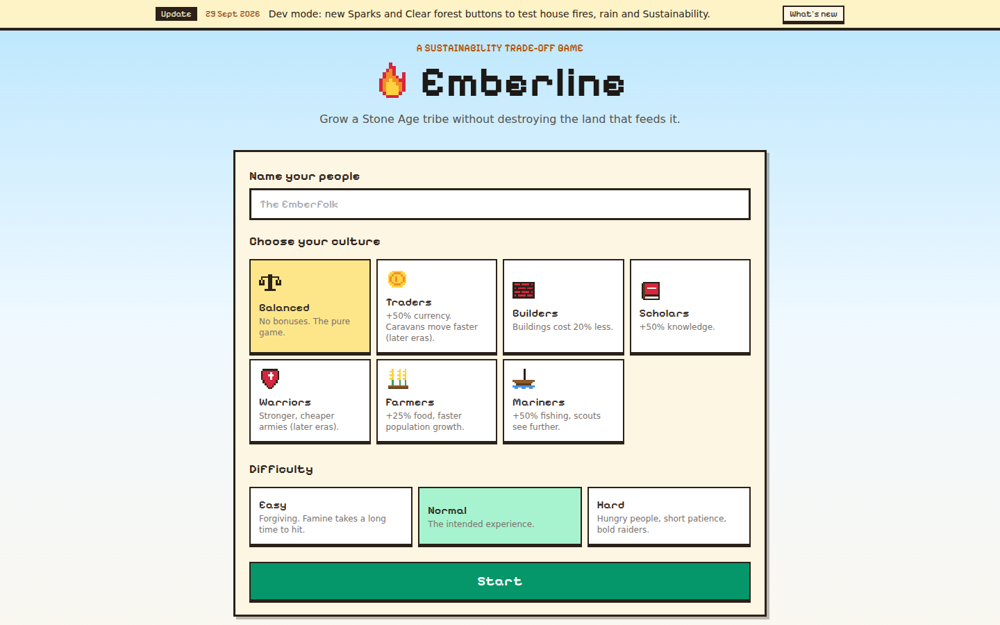 **Title screen.** Name the nation, pick a culture and a difficulty. |
| 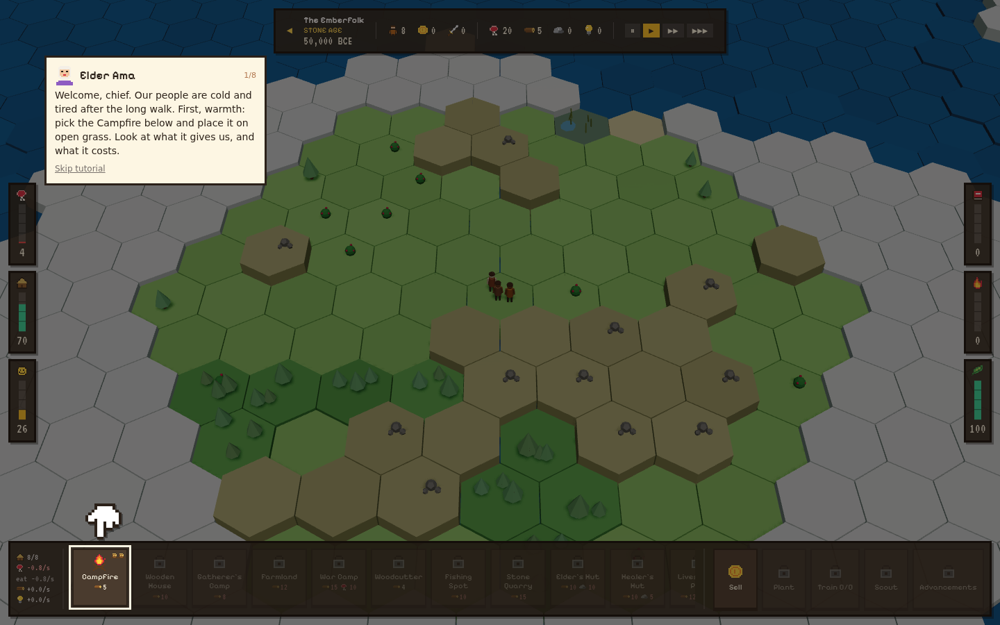 **Tutorial.** Elder Ama explains; the pixel hand points at the next click. | 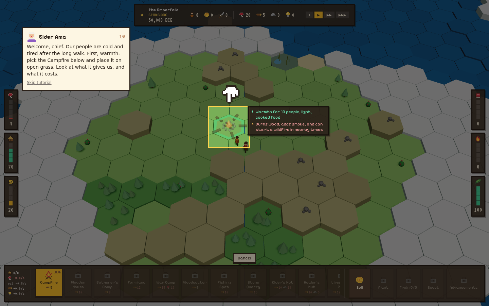 **Placement preview.** Every building shows its gain (+) and its cost to the land before you place it. |
| 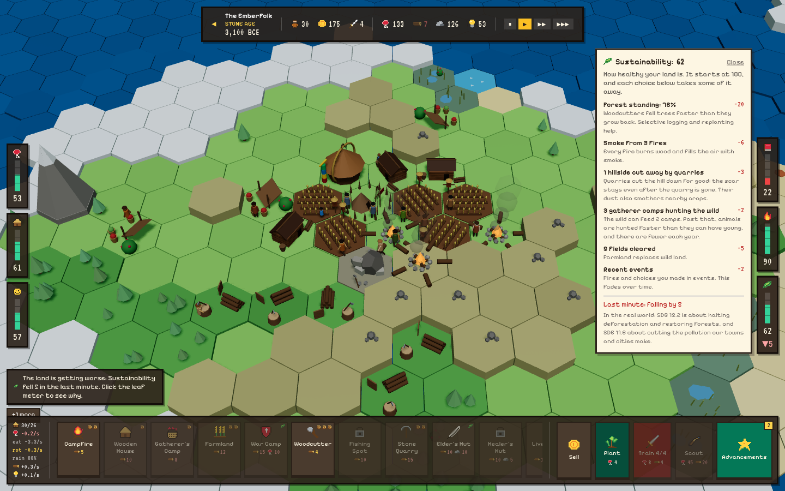 **Sustainability breakdown.** Click the leaf meter to see every part pushing it down, and the trend. | 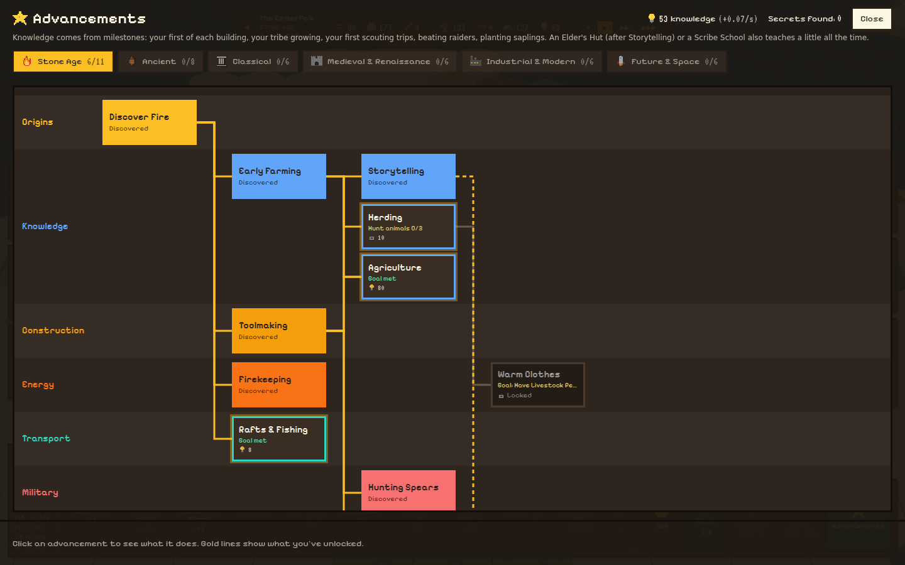 **Advancements.** Each one has a goal you must meet first (for example "Hunt animals 0/3"). |
| 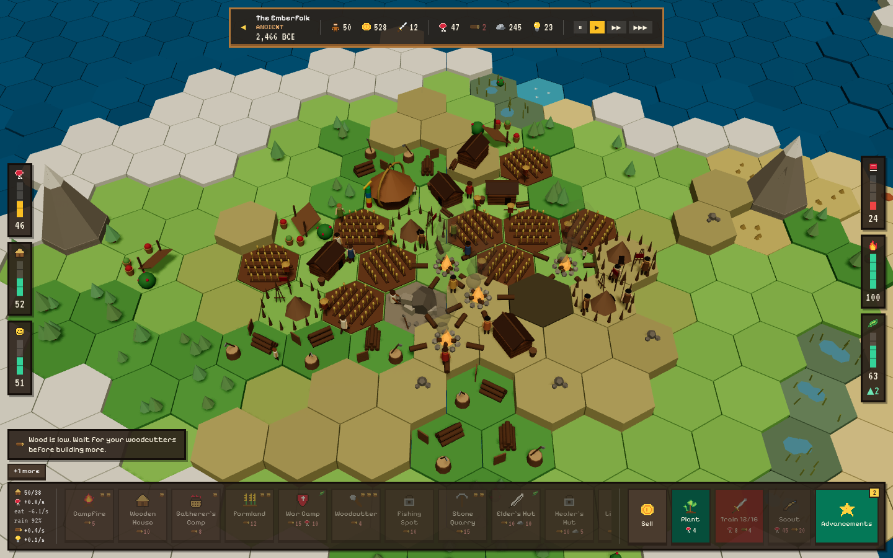 **Ancient era.** Dyed clothes, worn paths, warmer light, bronze trim on the top bar. | 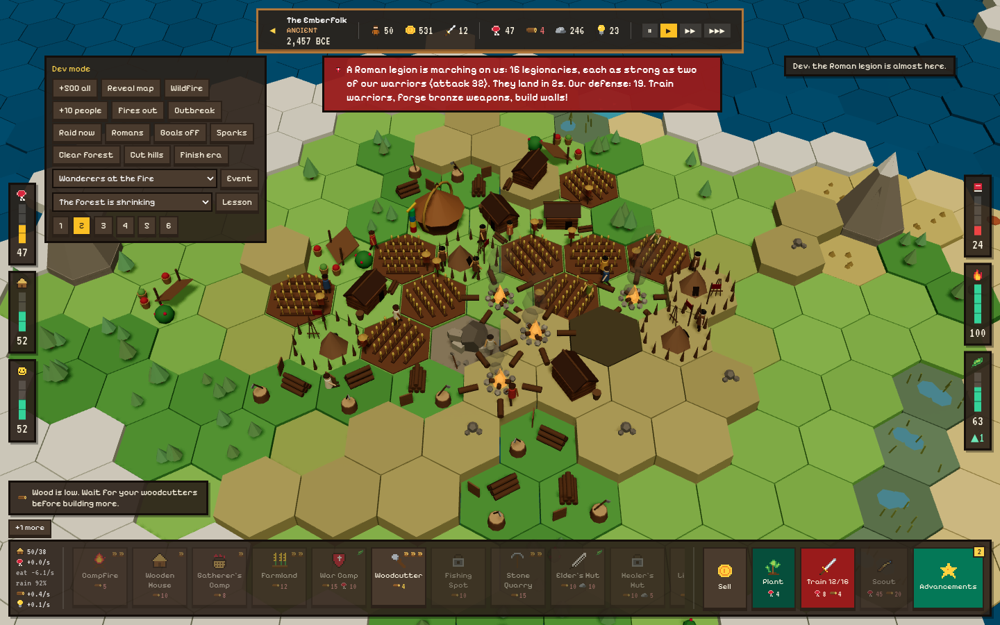 **The era's climax.** A Roman legion is coming (shown here with the dev panel open). |
| 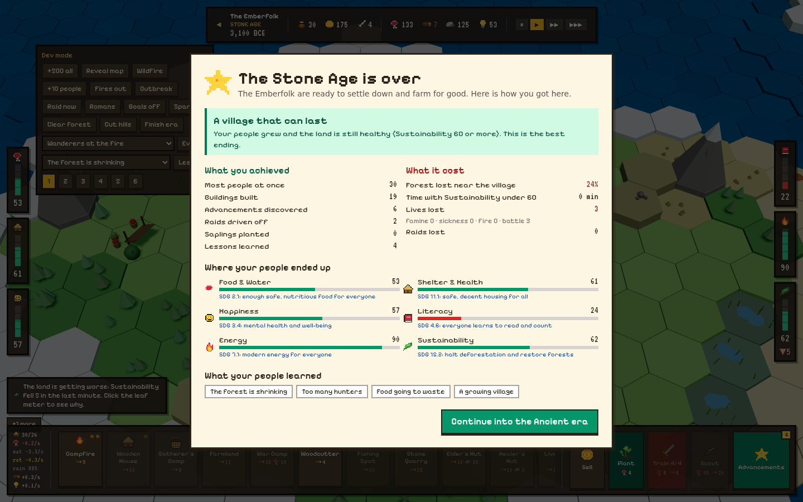 **Debrief.** What you achieved next to what it cost, each meter linked to an SDG target. | 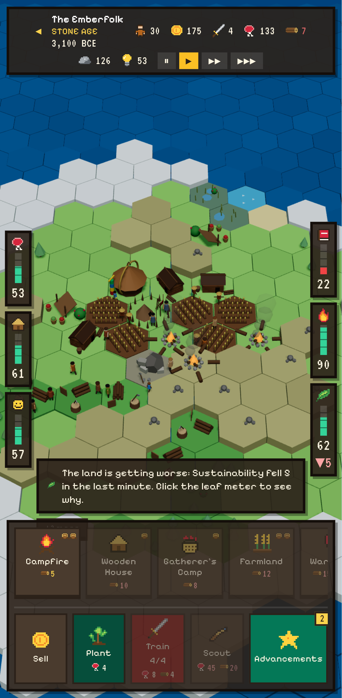 **On a phone.** Bars stack, tap once to preview and twice to build. |
|  **Medieval.** Castles, markets, windmills, an aqueduct; neighbouring kingdoms and the plague. |  **Industrial.** Factories and power plants: coal or wind, sun and water. |
|  **Future.** Air capture, vertical farms, arcologies; beat the tipping point, then space. | 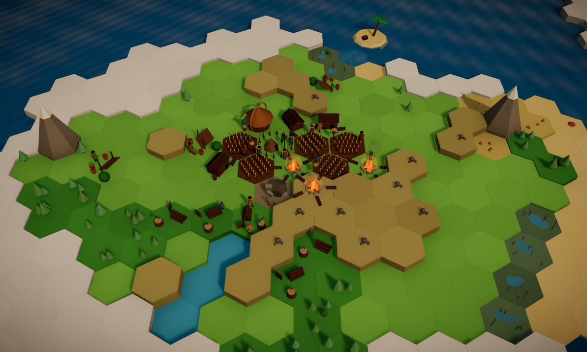 **Where it starts.** The same island, many centuries earlier. |

**Still to add (the team):** the gameplay video link and photos of the team
working (see the checklist at the top).
