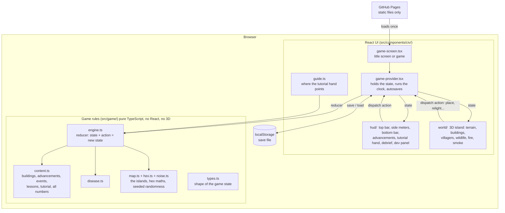
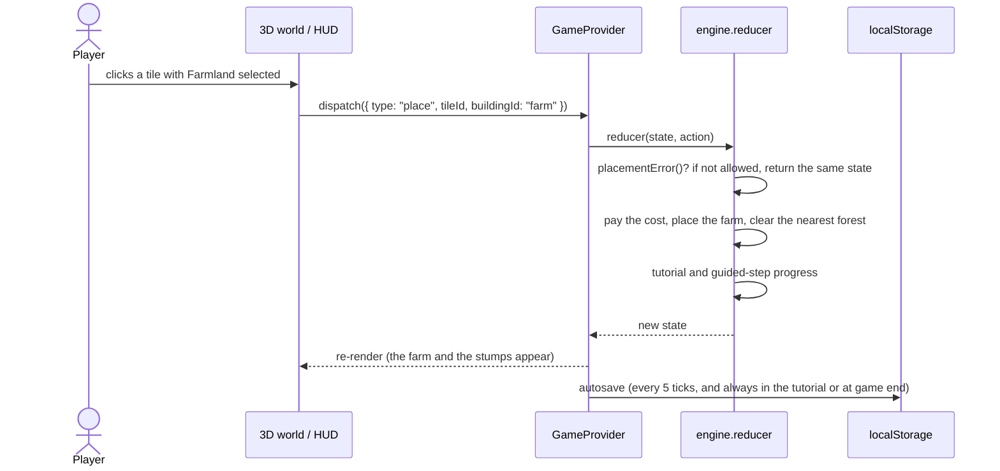
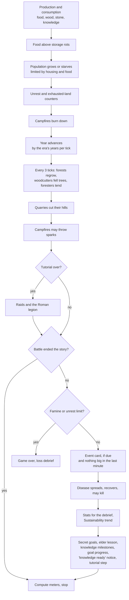

# Architecture

Emberline is a static website: HTML, JavaScript and 3D graphics that run
entirely in the player's browser. There is no server, no database and no
account. The game saves itself in the browser (`localStorage`).

**Built with:** Next.js 16 (static export), React 19, TypeScript (strict),
Three.js through React Three Fiber and drei, and Tailwind CSS. It is hosted on
GitHub Pages and deployed automatically on every push to `main`.

## 1. System overview



The key design decision is the split between **rules** and **screen**:

- `src/game/` holds every rule and every number. It has no React and no
  Three.js, so it can run on its own. We use that to run whole games in a
  few seconds with our test bot (see [process.md](process.md#3-how-we-test)).
- `src/components/civ/` only draws the state and sends the player's actions to the engine.

## 2. How one action flows

Everything the player does is an **action** sent to one reducer function. The
reducer never changes the old state; it returns a new one. React then redraws.



There are about 50 action types: playing (`place`, `scout`, `research`,
`train`, `relight`, `plant`, `setLogging`, `upgrade`, `demolish`,
`resolveEvent`…) and dev-mode tools (`devRaid`, `devSparks`, `devFinishEra`…).

## 3. The game clock (one tick)

`GameProvider` sends a `tick` action every 1.5 s at 1x speed (faster at 2x
and 4x). The clock is **held** while the tutorial hand or a guided step is
waiting for the player, while the Advancements screen is open, and during the debrief.

Each tick runs these steps in order (`tick()` in `engine.ts`):



## 4. Folder map

```
src/
  app/                    Next.js pages: landing page (/) and the game (/play)
  game/                   ALL the rules (pure TypeScript)
    engine.ts             the reducer, tick, meters, placement rules, save/load
    content.ts            data: eras, buildings, advancements, goals, events,
                          lessons, tutorial steps, and every tuning number
    disease.ts            outbreaks, spread, recovery
    map.ts, hex.ts        the four fixed islands and hex-grid maths
    noise.ts              seeded random numbers (mulberry32) and terrain noise
    sprites.ts            hand-drawn 12x12 pixel icons
    types.ts              GameState, Tile, Action shapes
    updates.ts            the "What's new" log shown to players
  components/
    updates-bar.tsx       the Updates bar on the landing and title pages
    civ/
      game-screen.tsx     title screen, then the game
      game-provider.tsx   state, clock, autosave
      guide.ts            where the tutorial hand points, which tile it suggests
      title-screen.tsx    nation name, culture, difficulty, dev-mode starts
      hud/                2D interface (bars, meters, panels, debrief, dev panel)
      world/              3D world (terrain, buildings, people, animals, sky)
docs/                     this documentation
AGENTS.md                 every design rule, kept up to date with each change
```

Size today: about 10,000 lines of TypeScript. `engine.ts` (about 2,300) and
`content.ts` (about 1,100) are the largest files.

## 5. What is in the content data

All game content is data in `content.ts`, not special cases in the code:

| Content | Count | Notes |
| --- | --- | --- |
| Eras | 6 | Stone Age and Ancient are playable; the rest are planned |
| Buildings | 18 | 11 Stone Age, 7 Ancient; each has gain, land cost and land impact |
| Advancements | 45 | Across all six eras and six branches; 21 sit in the two playable eras (16 to research, the starting one, 2 secrets, 2 marked "Coming soon") |
| Advancement goals and guided steps | 16 each | One for every advancement you can research today |
| Event cards | 12 | Each a trade-off with a `realWorld` line |
| Elder lessons | 16 | Each linked to an SDG target |
| Tutorial steps | 8 | Each hands over exactly what that step costs |
| Meters | 6 | Food & Water, Shelter & Health, Happiness, Literacy, Energy, Sustainability |

## 6. Rules the code follows

These keep the project reliable as it grows (the full list is in `AGENTS.md`):

- **Pure, predictable rules.** The engine never changes state in place and
  never calls `Math.random()`. It uses a seeded generator (`mulberry32`), so the
  same seed and actions give the same game. That makes bugs reproducible.
- **Content is data.** A new building is a new entry in `content.ts` with its
  gain, cost and land impact, not new code scattered through components.
- **Save versioning.** When the shape of the saved state changes, `SAVE_VERSION`
  goes up so an old save is discarded instead of crashing the game. Small
  changes are converted on load instead (for example, old saves get the new
  spearmen count).
- **Fast 3D.** Anything numerous (tiles, trees, people, animals) uses instanced
  meshes: one draw call for many copies. People on the map are representative
  (at most 20 figures), so a big tribe doesn't slow the browser.
- **Static only.** No server code, API routes or secrets, so it can be hosted
  free on GitHub Pages and can't leak anything.
- **Every change is checked.** Pull requests must pass lint, type-check and a
  production build (`.github/workflows/ci.yml`) before merging; `deploy.yml`
  publishes `main` to GitHub Pages.
- **Every feature is testable in dev mode.** `/play/?dev` starts in any era with
  plenty of resources, and a dev panel can trigger each feature: raids, the legion,
  wildfire, sparks, outbreaks, cutting hills, clearing forest, any event card, any
  lesson, "all goals met", and ending the era.
