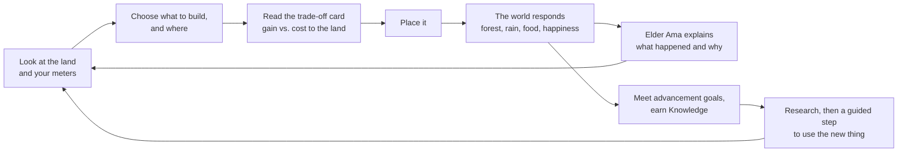
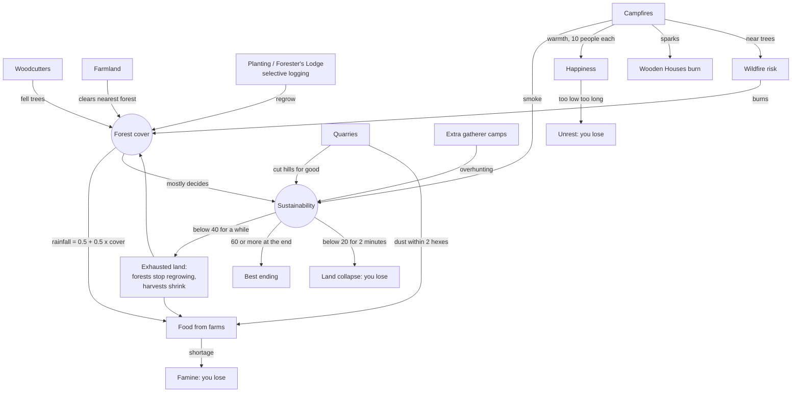

# Game design

## 1. The idea

Most city and civilization builders reward you for building as much as you can,
as fast as you can. The land underneath is a free, endless backdrop.

Emberline asks a different question: **can your village grow and still last?**
Every building has a real gain *and* a real cost to the land, and the game
shows both before you commit. Growing is easy; growing without stripping the
forest, drying out the rain and exhausting the soil is the challenge.

That is the heart of **SDG 11 (Sustainable Cities and Communities)**: a
settlement that meets its people's needs without wrecking the land it depends
on. Setting it at the very start of history makes the point simple. A tribe
with one campfire faces the same kind of choice a modern city does. It is
just smaller and easier to see.

**Who it is for:** students and anyone curious, with no prior knowledge. It
runs in a browser on a laptop or a phone, with nothing to install.

**What makes it different**

- **The price is always visible.** A placement card shows the gain (+) and the
  land cost for every building, on the tile, before you place it.
- **The damage is physical, not a number.** Woodcutters really fell the trees
  around them (stumps stay), farms clear the forest next to them, quarries cut
  the hill down for good, and fires scorch the grass. You can see a village's
  history on the map.
- **There is always a slower option that lasts.** Selective logging, planting
  saplings, a Forester's Lodge. The fast choice and the lasting one sit side by
  side.
- **You earn progress by doing, not by waiting.** Each advancement has a goal
  (for example, hunt three animals before Herding) and Elder Ama then walks you
  through using what you unlocked.
- **The game explains itself in plain words.** Elder lessons link what just
  happened on your island to a real UN SDG target, with no statistics.

## 2. The core loop

A game has clear stages: an 8-step tutorial, a calm period, then growing
pressure (bigger raids, sickness in crowded homes, food that rots, fires that
go out). To leave the Stone Age you research Agriculture and grow to 15
people. The Ancient era ends with a Roman legion landing on your shore. After
each era a **debrief** lists what you achieved next to what it cost.

There are four ways to lose, each announced by a countdown first: **famine**,
**unrest** (people too unhappy for too long), **land collapse**
(Sustainability below 20 for about two minutes), or being **conquered** by the
legion. Everything else is a setback you can recover from.

## 3. The chosen feature: trade-offs you can see

Our chosen feature is the **sustainability trade-off system**: every choice
gains something and costs the land something, and the player can always see both.
We built it as the rules the whole game runs on, not as an extra screen.

### How a single trade-off works, end to end

Take **Farmland**, one of the newest trade-offs:

1. **Data.** In `src/game/content.ts` Farmland has `gain` ("Lots of steady
   food"), `landCost` ("Clears the nearest patch of forest for good…") and a
   `landImpact` score (0–3 stumps shown on its card).
2. **Preview.** When you hover a tile, `placementHarm()` in `engine.ts` works out
   what this farm would do *here*, and the placement card says so.
3. **Rule.** When placed, the engine clears the nearest unprotected forest tile
   within 2 hexes (`forestToClear()`).
4. **Knock-on effect.** Rainfall = 0.5 + 0.5 × forest cover (`rainfall()`), and
   every field grows that share. Fewer trees, less rain, less food from *all*
   your farms.
5. **Feedback.** The food stats show "rain %". A warning appears below 80%.
   The Sustainability breakdown lists "Fields cleared". Elder Ama's "rain"
   lesson explains that forests help bring rain, linked to SDG 15.3.
6. **The alternative.** Plant saplings or build a Forester's Lodge to bring the
   forest, and the rain, back.

Every trade-off follows the same six steps: data → preview → rule → knock-on
effect → feedback → alternative. So adding a new one is cleanly one pattern,
not a special case.

### All the trade-offs in the game today

| Choice | What you gain | What it costs | The lasting alternative |
| --- | --- | --- | --- |
| Woodcutter | Wood | Fells the trees around it; forest regrows slowly | Selective logging (half the wood, the forest lasts), planting |
| Campfire | Warmth for 10 people, light, energy | Burns wood, smoke, wildfire risk near trees, sparks can burn nearby wooden houses | Firekeeping (fires last longer, fewer sparks), leave a gap between fires and houses |
| Farmland | Steady food | Clears the nearest forest for good; less forest, less rain for every field | Replant elsewhere, Forester's Lodge |
| Gatherer's Camp | Food, best on berries | Past 2 camps: little extra food and overhunting (−2 Sustainability each); 30% less food right beside a fire | Farms and fishing instead of more camps |
| Stone Quarry | Stone | Cuts the hill down for good; dust cuts food from farms, camps and pens within 2 hexes by 40% | Put it far from the fields (the tutorial hand does) |
| Livestock Pen | Food; with Warm Clothes, keeps 6 people warm | Grazing wears the land (−2 each) | Fewer fires needed, so less wood cut |
| Bronze Smithy (Ancient) | +20% food and wood per smithy (up to 3) | Burns charcoal (wood) every tick, −4 Sustainability | Forester's Lodge to keep up with the wood |
| Irrigation Canal (Ancient) | Next-door farms +50% | Salts the soil (−3) | Fewer, well-placed canals |
| Event cards (12) | Each choice gains something | …and costs something | You pick which price to pay |

### What the player sees

- **Placement card** beside the hovered tile (never on it): green = gain, red = cost, plus any warning
  for *this* spot.
- **Sustainability meter** (the leaf). Click it for `sustainabilityBreakdown()`:
  every part pushing it down or up, and whether it rose or fell in the last minute.
- **The map itself**: stumps, cleared ground, scorched grass, cut rock, haze
  from many fires, dry grass on exhausted land, fewer animals.
- **Elder lessons** (16), each tied to an SDG target.
- **The debrief**: forest lost, time spent with low Sustainability, and lives lost by cause.

## 4. How the systems fit together

The trade-off feature is not a separate mode. The same land numbers feed food, happiness, safety and the ending.

Other systems join the same web:

- **Population** grows only with food and housing. A bigger tribe eats more,
  needs more fires, gets sick more easily in crowded homes and draws bigger raids.
- **Knowledge** comes from milestones (first of each building, population
  steps, first raid won, first planting, early scouting trips) and from
  Elder's Huts and schools. It pays for advancements, and each advancement
  also has a goal you must meet by playing.
- **Military** is a side system: raids force a basic army, spearmen fight
  1.5x, and the Roman legion scales with your population, so growing
  huge also has a price.
- **Events** are trade-offs too, and each card has a `realWorld` line.
- **Pacing:** only one "big moment" (event, raid landing, lesson, surprise
  outbreak) starts per minute, so the player can read each one.

## 5. Links to the SDGs

| SDG | Where it is in the game |
| --- | --- |
| **11 Sustainable Cities and Communities** (core) | The whole trade-off system: growing a settlement that lasts. Shelter & Health meter (target 11.1), "growing village" and "crowding" lessons (11.3, 11.1). |
| 15 Life on Land | Forest cover, rain, exhausted land, wildlife only in mature forest, planting (15.2, 15.3, 15.5). |
| 12 Responsible Consumption and Production | Food rots above storage, overhunting, charcoal for bronze (12.2, 12.3). |
| 7 Affordable and Clean Energy | Energy meter (fires), smoke, Warm Clothes means fewer fires (7.1, 7.3). |
| 4 Quality Education | Literacy meter, Elder's Hut and Scribe School, the "writing" lesson (4.6). |
| 2, 3 | Food & Water meter (2.1), Happiness meter (3.4), shown in the debrief. |

We kept every real-world line modest and general. The game contains **no
statistics**; the SDG target numbers and wording are from the UN goals.

## 6. Look and usability

- **Style:** bright, chunky low-poly 3D world (every model is built from several
  shapes: roofs, doors, props) with a **pixel-art 2D interface**. There are no emojis:
  all icons are hand-drawn 12x12 pixel sprites (`src/game/sprites.ts`).
- **Light, readable UI:** the landing and title pages are light; numbers use a
  separate pixel font whose digits are easier to tell apart.
- **Nothing covers the map:** six slim meters (three each side), a top bar and a
  bottom bar. Panels stack and never overlap. At most 2 toasts show at once, and only the most
  urgent warning shows (the rest behind "+N more").
- **Teaching by doing:** an 8-step tutorial where a pixel hand points at the next
  click and the clock is held, then guided steps after each advancement. Tutorial locks
  show only what has been introduced so far.
- **Clear status:** unaffordable buildings are dimmed; low food or wood flashes
  red in the top bar with a plain warning of what to do; famine and unrest
  show a countdown first.
- **Each era looks different:** in the Ancient era villagers wear dyed linen,
  warriors wear leather, the light is warmer, paths wear into the grass and the
  top bar gets a bronze trim.
- **Phones work:** bars stack and scroll; tap once to preview, twice to build;
  an on-screen Cancel instead of Esc or right-click.
- **Accessible pacing:** pause, 1x, 2x and 4x; autosave in the browser; an
  Updates bar shows what changed.
