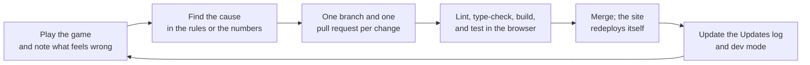

# Process: how we worked, what went wrong, and how we test

## 1. How we work

- **One change, one pull request.** Every feature or fix gets its own branch
  and pull request (more than 70 so far), so each change is small, reviewable,
  and easy to undo.
- **Checks before merging.** `npm run lint`, `npm run typecheck` and `npm run
  build` must pass locally and in GitHub Actions.
- **Players see what changed.** Every change a player would notice gets a
  plain-language line in the Updates bar (`src/game/updates.ts`).
- **Every feature can be tested on demand.** Each new mechanic gets a dev-panel
  button, so we can trigger a raid, a spark or the legion without waiting.

### Using an AI coding assistant

We built Emberline with an AI coding assistant (Claude Code), and most of the
code was written by it. The team set the direction and made the decisions: what
the game is and its rules, which option to take for each feature,
what felt wrong in playtests, and whether each change was good enough to merge.
The assistant wrote and tested the code, ran the balance bot and drafted the
documentation, which we reviewed. The "How we built this" section of the
[main README](../README.md) says the same.

## 2. Problems we hit, and how we solved them

For each problem we used the same approach: **what did the player see → what
caused it → what we changed → how we checked the fix.**

| What the player saw | The cause | What we changed | How we checked |
| --- | --- | --- | --- |
| "It doesn't feel like a game." Our first version was a turn-based city sim of meters and buttons. | No world to look at, no reason to care about the land. | Rebuilt it as a real-time 3D hex-island builder where damage is visible on the map. | Played it ourselves. |
| Multiplayer needed a server. | Free static hosting (GitHub Pages) can't run one. | First we cut it to ship. Later we brought it back without a game server: every player runs the game in their own browser, and only scores, gifts and raids go through a small database; bots are worked out the same way in every browser. | A live room created and played; database functions tested as an anonymous user. |
| Smog and grey skies in the Stone Age. | We borrowed a modern idea of pollution. | Made the damage fit the era: smoke only from fires, and Sustainability based on the forest actually left standing. | Checked every consequence against "would this happen in the Stone Age?" |
| Players survived but learned nothing. | The cost of each choice was hidden. | Put the trade-off on every decision: placement cards, the Sustainability breakdown, lasting alternatives, elder lessons, event cards with real-world lines. | Every building's card and the breakdown panel now show a cost; a browser test checks the card appears. |
| Some buildings had no downside (spamming gatherer camps; the quarry). | A cost nobody feels isn't a trade-off. | Extra camps give little food and cause overhunting; quarry dust cuts nearby harvests and the hill never grows back. | The Sustainability breakdown shows the overhunting and cut-hill lines; the placement card warns before you build. |
| Reaching the next era in 5 minutes by spamming scouts. | Knowledge came too easily from one action. | Knowledge now comes from milestones, and every advancement also has a goal you must meet by playing. | The balance bot (below). |
| After slowing Knowledge, the game became impossible. | We over-corrected, and one change hit several systems at once. | The bot showed wood running out, Agriculture out of reach, raids outgrowing any defense and the legion arriving before bronze weapons. We rebalanced each one. | Bot runs before and after each change. |
| "Holy moly, that's a lot of resources at the start!" | The tutorial gave out everything it would need up front. | Elder Ama now hands over each step's exact cost when the step starts. | A browser script plays the whole tutorial and checks it can be finished. |
| Too many things happening at once. | Events, raids, lessons and outbreaks each had their own timer. | One shared rule: only one big moment may start per minute; the rest wait. | We measured big moments per minute over whole bot games: at most 1–2 after the change. |
| Thatched huts before farming existed. | Straw comes from farmed grain. | The Stone Age home became a log-and-bark Wooden House, which gave fire a new trade-off: sparks can burn it. | One simulated 25-minute game: 5 houses burned without Firekeeping, 2 with it. |
| The tutorial hand pointed a quarry right next to the farms. | The hand picked the nearest free tile. | The hand now avoids any spot the placement card would warn about, and puts quarries as far away as it can. | Browser test of the tutorial step. |
| You couldn't tell the eras apart. | Only the building list changed. | Ancient-era clothes, worn paths, warmer light and a bronze trim. | Side-by-side screenshots (see [the screenshots](README.md#screenshots)). |
| "Fire" read as "Are". | The pixel font joins "fi" into one letter (a ligature). | Turned ligatures off everywhere, in the game and on the project page. | Screenshots of both. |
| Our first version of tiredness made every bot game miserable. | Each building needed a whole worker, so a normal town was always "overworked". | Half a worker per building, warriors help half the time, slower build-up. | Bot games: losses went from 4 in 12 back to 1 in 12, and tiredness now only appears in over-armed towns. |
| "Too crowded": the multiplayer panel covered the island. | We showed every player's details at once. | A small side menu, closed by default; tap a player for gift and raid. | Screenshots on a laptop and a phone. |
| "I can't see the open rooms." | The list was hidden when it was empty. | It's always shown now, with a clear "no open rooms right now" line. | Browser test of the lobby. |

### Adapting to change

- **We pivoted early** from a turn-based sim to a real-time 3D builder when
  the first version didn't work, instead of polishing the wrong idea.
- **We cut scope to ship, then brought it back the cheap way.** Multiplayer
  went first; later we rebuilt it without a game server. We finished one era
  at a time, each with its own ending, before starting the next; all six are
  now playable.
- **Feedback changes the rules, not just the text.** When a player found the
  line "fights half again as hard" confusing, we switched to plain numbers
  (1.5x). When the start felt too rich, we changed how the tutorial hands out supplies.
- **Every era is designed around a new trade-off and ends in a test of it:**
  the Roman legion (Ancient), the great drought (Classical), the plague
  (Medieval), the climate crisis (Industrial), and the tipping point
  (Future).

## 3. How we test

### Automatic checks on every pull request

`lint` (code style and common mistakes), `typecheck` (TypeScript in strict
mode) and a full production `build`, run by GitHub Actions (`.github/workflows/ci.yml`).

### The balance bot

Because all the rules are pure TypeScript with no screen attached, we can
compile `src/game/engine.ts` and run a whole game in a few seconds. Our bot:

- skips the tutorial, then follows a sensible build order;
- logs selectively and replants when Sustainability drops below 60;
- saves up for key buildings, trains warriors, and upgrades them to spearmen;
- researches in a fixed order, and moves to the Ancient era as soon as it can;
- uses exactly the same `reducer` as the real game, one `tick` at a time
  (1 tick = 1.5 s at normal speed).

**Latest results (5 games, run while writing these docs, 29 September 2026):**

| Game | Reached the Ancient era | People then | Legion result | Time of the battle |
| --- | --- | --- | --- | --- |
| 1 | 19.2 min | 46 | Lost | 33.4 min |
| 2 | 18.5 min | 43 | Lost | 32.7 min |
| 3 | 18.8 min | 41 | **Won** | 33.0 min |
| 4 | 20.8 min | 43 | **Won** | 35.0 min |
| 5 | 20.2 min | 50 | **Won** | 34.4 min |

**Latest check (12 games, 4 October 2026, after the tiredness and legion
changes):** 11 of 12 games reached the Ancient era (median 9.8 minutes; we had
since made Agriculture easier to reach); 7 met the Roman legion, and 6 of
those won. Only 1 game of 12 was lost.

What the September table told us: a sensible player reaches the second era in roughly 20
minutes (not 5), and the Roman legion is beatable but not guaranteed. Both are
what we designed for. These are bot times; a new human player, who also reads
the tutorial and the lessons, will be slower.

### Browser tests

We drive the real game in a headless Chrome with Playwright to check things a
bot can't see:

- the whole tutorial can be played through by following the pointing hand;
- panels never overlap, on a laptop and at phone size (Pixel 7);
- tutorial locks, the countdowns, and the debrief;
- every screenshot in these docs, taken from the current build.

### Dev mode

`/play/?dev` lets anyone check a feature in seconds: start in
any era with plenty of resources, then trigger raids, the legion, wildfire,
sparks, outbreaks, any event card or lesson, or end the era.
